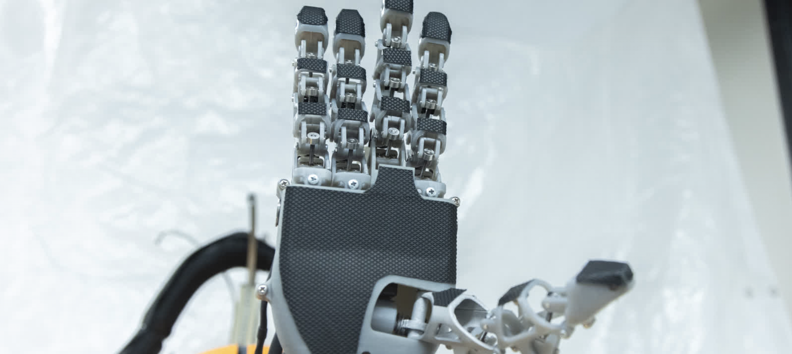

# Krysalis Hand

## Overview
Krysalis Hand is a five-finger robotic end-effector that combines a lightweight design, high payload capacity, and a high number of degrees of freedom (DoF) to enable dexterous manipulation in both industrial and research settings. 

The Krysalis repository holds all the code necessary to operate the *Krysalis Hand* and conduct *teleoperation* using the MANUS Meta Glove. It is recommended to use a Linux machine to run this code.

You can learn more details of our robotic hand from our [preprint paper](https://arxiv.org/abs/2504.12967).

## Robot Operations

### Hand-Codes

The Hand-Codes repository contains all of the firmware for all of the Arduinos. The master runs on a Raspberry Pi Pico, while the MCP, PIP, DIP, Thumb, and Wrist modules run on Arduino Megas. The abduction motor is driven by a Robotis OpenRB-150, programmable via the Arduino IDE.

## Teleoperation

### SDKClient_Linux

The MANUS SDK is used to pull real time fingertip data from the MANUS Glove to the ROS 2 Nodes which is then used to calculate the joint angles for teleoperation. For specific steps on downloading and running the SDK, check out the SDKClient_Linux [Readme](https://github.com/Soltanilara/Krysalis_Hand/tree/main/SDKClient_Linux)

This code is pulled from the LEAP Hand's [Bidex Manus Teleop](https://github.com/leap-hand/Bidex_Manus_Teleop) repository for teleoperating their hand using the MANUS Meta Gloves. It is similar to the MANUS [C++ SDK](https://docs.manus-meta.com/2.4.0/Plugins/SDK/) but adds [ZMQ bindings](https://github.com/zeromq/cppzmq/tree/master) to communicate with the ROS 2 package. 

### glove_ROS

The glove_ROS repository contains the ROS 2 package for teleoperating the Krysalis Hand. It uses ROS 2 messages to communicate with the Raspberry Pi Pico, and it uses Pybullet for calculating joint angles via inverse kinematics.

This code is also pulled from the LEAP Hand's [ROS 2 Library](https://github.com/leap-hand/Bidex_Manus_Teleop) for teleoperating their hand from using the MANUS Meta Gloves. We  repurposed the code to fit the dimensions of the Krysalis Hand. 

