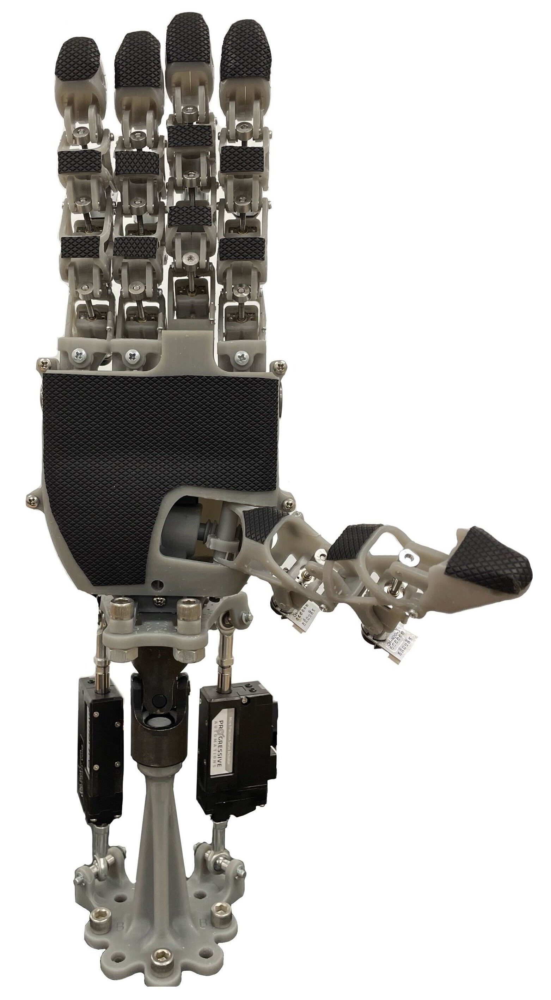

# Krysalis Hand

## Overview
Krysalis Hand is a five-finger robotic end-effector that combines a lightweight design, high payload capacity, and a high number of degrees of freedom (DoF) to enable dexterous manipulation in both industrial and research settings. 

The Krysalis repository holds all the code necessary to operate the *Krysalis Hand* and conduct *teleoperation* using the MANUS Meta Glove. 

To learn more about the details of our robotic hand, check out our [paper](https://arxiv.org/abs/2504.12967).

## Modules:

### Hand-Codes

Contains the firmware for running the Krysallis hand.

### SDKClient_Linux

This code is pulled from the LEAP Hand's [ROS 2 Library](https://github.com/leap-hand/Bidex_Manus_Teleop) for teleoperating their hand from using the MANUS Meta Gloves. It is similar to the MANUS [C++ SDK](https://docs.manus-meta.com/2.4.0/Plugins/SDK/) but adds [ZMQ bindings](https://github.com/zeromq/cppzmq/tree/master) to communicate with the ROS 2 package.

### glove_ROS

This code is also pulled from the LEAP Hand's [ROS 2 Library](https://github.com/leap-hand/Bidex_Manus_Teleop) for teleoperating their hand from using the MANUS Meta Gloves. We repurposed the ROS 2 code to fit the dimensions of the Krysallis Hand.
